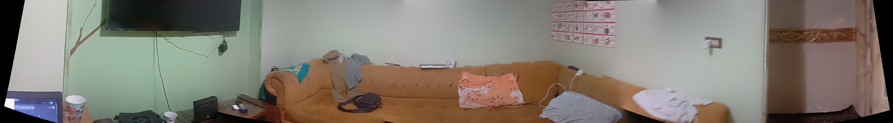

# Panorama Capture with OpenCV

This project captures frames from a webcam and stitches them together into a panorama using OpenCV's `cv2.Stitcher`.  
It displays a live feed prompting you to **rotate your camera slowly**, then generates and optionally saves the final panorama.

---

## Example Output
 
 
---

## Example
```python
from panorama import pan

# Save panorama as PNG OPTIONAL
pan("results/my_panorama.png")
```

---

## Features
- Live camera preview with on-screen instructions.
- Captures multiple frames and automatically selects a subset for efficiency.
- Uses OpenCV's `Stitcher` class to create panoramas.
- Displays the panorama using Matplotlib.
- Optionally saves the result to an image file.

## Requirements
- Python 3.x
- [OpenCV](https://pypi.org/project/opencv-python/)
- [NumPy](https://pypi.org/project/numpy/)
- [Matplotlib](https://pypi.org/project/matplotlib/)

## How It Works
1. Opens the webcam (`cv2.VideoCapture`).
2. Displays each frame with the message: **"Rotate camera slowly"**.
3. Captures frames until you press **Esc**.
4. Keeps only ~10% of frames to avoid processing too many.
5. Uses OpenCV's `Stitcher_create()` to combine frames into a single panorama.
6. Shows the final panorama in a Matplotlib window.
7. Optionally saves it to the given `store_path`.

## Notes
- Press **Esc** to stop capturing and start stitching.
- Ensure you rotate the camera smoothly and keep enough overlap between frames.
- `store_path` **must** have a valid image extension (e.g., `.jpg`, `.png`) and point to an existing folder.
---

*Developed by Mohammed Yasser Mohammed* 
*call me ;)*


*email : es-mohamed.yasser2027@alexu.edu.eg* 

